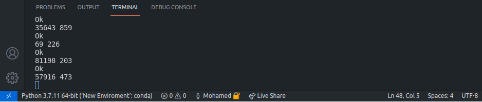

# Fibonacci Number

## Explanation

The idea of this code is that we will make a list of the **Pisano period** for a given `m`. Then, we will get `F(n) MOD` the length of the Pisano period.

The tricky property of the Pisano period is that whatever the number of `m`, the period begins with consecutive `0` and `1`. This pair of numbers is not repeated throughout the period.

## Pseudo-code

```python
def get_fibonacci_huge_fast(n, m):
    previous = 0
    current = 1

    pisano_period = []

    # Finding the Pisano period
    while pisano_period[-2:] != [0, 1]:
        previous, current = current, (previous + current) % m
        pisano_period.append(current)

    # Reset to start the Fibonacci mod sequence
    previous = 0
    current = 1

    # Use Pisano period length to find the desired Fibonacci number
    for i in range(n % len(pisano_period)):
        previous, current = current, (previous + current)

    return previous % m
```

## Stress Testing

```Python
if __name__ == "__main__":
    while True:
        m = random.randint(1, 10 ** 5)
        n = random.randint(2, 10 ** 3)
        print(n, m)
        if get_fibonacci_huge_naive(n, m) != get_fibonacci_huge_fast(n, m):
            print("Wrong!")
            break
        else:
            print("OK")
```



## Referances

I. Bhargava, A. Grokking algorithms (1st ed., p. 65).

II. Haran, B. (2021). Fibonacci Mystery - Numberphile. Youtube.com. Retrieved 11 November 2021, from [Youtube](https://www.youtube.com/watch?v=Nu-lW-Ifyec).

III. Yatsko, J. (2021). A New Way to Look at Fibonacci Number. Youtube.com. Retrieved 11 November 2021, from [Youtube](https://youtu.be/o1eLKODSCqw).
