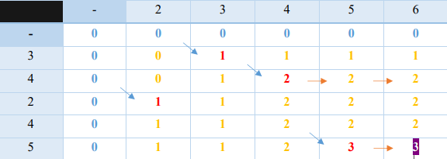

# Longest Common Subsequence of Two Sequences

## I. Naive Approach (Recursively)

### Explanation

Generate all subsequences of both given sequences and find the longest matching subsequence.

### Pseudo-code

```Pseudo
Def lcs(a, b, left, right):
1 if m == 0 or n == 0:
2   return 0
3 else if a[m-1] == b[n-1]
4   return 1 + lcs(a, b, m-1, n-1)
5 else
6   return max(lcs(a, b, m, n-1), lcs(a, b, m-1, n))
```

---

## II. Enhanced approach (using Dynamic Programming):

### Explanation

Create a matrix (n+1*m+1), n and m are the lengths of X and Y.

- The 1st row and column will be filled with zeros (Initial values because there's no matching in the beginning).

- If the two characters in the row and the column are matching, then fill the cell by adding one to the number in the previous diagonal cell.

- Else fill the cell by the maximum value from the previous column and previous row.

Repeat until the matrix is full, then return the last element in the matrix which represent the
longest common subsequence of the two sequences X and Y.

### Example

Let 1st sequence = 2 3 4 5 6

Let 2nd sequence = 3 4 2 4 5



The matrix will be:

```
  0 0 0 0 0 0
  0 0 1 1 1 1
  0 0 1 2 2 2
  0 1 1 2 2 2
  0 1 1 2 2 2
  0 1 1 2 2 3
```

Answer = 3

### Pseudo-code

```Pseudo
Def lcs2(a, b):
1	n = len(a)
2	m = len(b)

3   M = matrix of zeros with size (n+1 * m+1)
4
5   loop i from 0 to n+1
6       loop j from 0 to m+1
7           if i == 0 or j = 0  # Blue indices in explanation 
8               M[i][j] = 0
9           Else if a[i-1] = b[j-1]
10              M[i][j] = M[i-1][j-1]+1  # Red numbers in explanation
11          Else
12          	   M[i][j] = max(M[i-1][j] , M[i][j-1])  # Yellow numbers in explanation 
13   return M[m][n]  # Return last indices in matrix (White number in explanation)

```

```Pseudo
Def merge (a, b):

1   set c empty list
2   i = 0
3   j = 0
4   numOfInversions = 0
5
6   while i < length of a:
7       if j = length of b:
8           c += a[i:]
9           break
10
11      if a[i] = b[j]:
12          append a[i] to c
13          i += 1
14
15      elif a[i] > b[j]:
16          append b[i] to c
17          numOfInversions += len(a) - i
18          j += 1
19      else:
20          append a[i] to c
21          i += 1
22
23  if j < len(b):
24      c += b[j:]
25
26  return (c, numOfInversions)


```

## References:

I.	Longest Common Subsequence | DP-4 - GeeksforGeeks
II.	Longest Common Subsequence (programiz.com)
